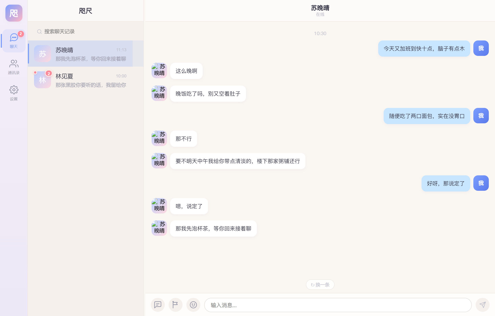

# 咫尺

[](https://github.com/oaa529/zhichi/actions/workflows/ci.yml)
[](./LICENSE)




> 微信风格 + 二次元立绘的 AI 角色对话应用。核心是一套「拟真引擎」：
> 把 LLM 的流式输出转换成**像真人聊天**的消息流（分条、打字节奏、犹豫、错别字、
> 作息感知、说漏嘴后撤回），而不是让整段回复一次性砸出来。

自用向的单机应用：数据全部存在浏览器本地（IndexedDB），API Key 只驻留内存、不落盘。

> 没有后端、没有云依赖：clone 下来装个依赖就能跑。
> 测试套件在 **Windows 本机 + Linux（GitHub Actions）+ UTC/纽约/伦敦三个时区**下都验证过，
> 换机器不会因为时区或路径差异变红。

---

## English

**Zhichi (咫尺)** — a WeChat-style chat UI for talking with AI characters, built around a
"realism engine" that turns one LLM stream into a **human-like message flow**: replies arrive
as several short bubbles, with typing rhythm, hesitation, occasional typos (auto-corrected),
presence awareness (a character with a sleep schedule may answer half-asleep, or next
morning), and the occasional "oops, let me take that back".

Characters also **remember**: long-term memory is extracted in the background and retrieved
by relevance, and each session has a **story state card** (chapter / scene / open threads /
event timeline). Everything is local-first — data lives in your browser's IndexedDB, and the
API key stays in memory only: it is never written to disk and never sent anywhere except the
LLM provider you configure.

```bash
corepack enable pnpm          # Node >= 18
git clone https://github.com/oaa529/zhichi.git && cd zhichi
pnpm install && pnpm dev      # http://localhost:5174 — works offline with the Mock adapter
```

Scope: **text chat + character art only** — no voice / video / image messages.
The UI and docs are in Chinese. Licensed under [MIT](./LICENSE).

---

## 功能一览

**对话体验**

- 三栏布局（导航 / 会话列表 / 聊天区），侧栏宽度可拖拽调整
- 拟真消息流：按标点分条、气泡之间存在自然停顿、逐字打字机动画、偶发错别字并自动纠正
- 作息感知：角色有起床/入睡时间，睡眠时段可配置「半梦半醒短句 / 静默不回复 / 次日补发」
  - **忙碌时段**：可配多段（可跨午夜、带文案如"在上课"），期间角色状态显示为
    该文案、回复更短更"待会儿再说"，但**不拦回复**（睡着才看不到消息）；
    睡眠优先于忙碌。标题栏会实时显示在线 / 在上课 / 已就寝
    - **会话列表里也能看出来**：只有非在线状态才显示（名字后一个小胶囊，
      忙碌用警示色），于是满屏会话里"现在该找谁、别打扰谁"一目了然；
      状态由角色作息推导，每分钟刷新一次
- 「对方正在输入…」指示器；时间分隔线与会话列表时间都是微信式文案（今天 / 昨天 / 星期X）
- **引用**：点某条消息「引用」再提问，那段原话会随提问一起进 Prompt——
  哪怕原句早被上下文裁掉，角色也能接得上；提示词里还专门教了它
  "引用块里的话确实是自己说过的，别否认"（真机复核里抓到过
  "团团？我没有说过这个呢"这种翻车）
- **角色知道"现在几点、上一句隔了多久"**：每轮 Prompt 开头注入【现在】
  （年月日、星期、钟点，按**角色时区**算）与【上一句】（隔 ≥ 1 小时才写），
  于是晚上不会说"早上好"、被问时间答得出来、隔三天再聊会自然提一句空档；
  角色卡里的 `timezone` 也终于真的生效——睡眠/忙碌时段按角色所在时区判定。
  详见 `core/src/time/Clock.ts`
- **防复读**：角色最近几轮说过的话（从历史里现算，不新增存储）会整理成
  一段【别重复】压在同一次请求的最尾部——开头句与结尾句这类"套公式"的位置
  最容易被念第二遍；短口头禅（"嗯""在的"）与贴图占位不列，避免把它变成木讷的
  复读机反而更假。这段占多少字符在「上下文占用」里单独一行可见。
  详见 `core/src/llm/AntiRepeat.ts`
- **超时按"没动静"算，不按"总时长"算**：流式回复只要还在出字就不会被掐断，
  卡住不动才判超时（可重试；已经出过字就保留已收到的部分，不会重来一遍）。
  慢一点的供应商（尤其推理模型）不会再出现"回复写到一半被中断"。
  设置里那一项已改名为「无数据超时」。详见 `core/src/llm/OpenAIAdapter.ts`
- **心情有惯性**：角色的情绪不是一条条独立的——最近几轮聊下来会攒成一个"心情"，
  注入 Prompt 让语气跨轮次连贯（刚闹完别扭不会下一句就乐呵呵），
  文本看不出情绪时立绘也跟着心情走；时间会冲淡它（半衰期两小时），
  平淡的对话会把它自然稀释。详见 `core/src/emotion/MoodTracker.ts`
- 微信式细节：回复期间仍可继续发消息（自动排队）、按会话保存输入草稿、未读红点与未读数、
  右键或长按气泡复制文本、长按头像切换固定立绘
  - **排队消息不会丢**：回复期间发出的那几条会跟着会话快照一起保存，
    切走再切回来（或刷新）依然会被逐条回复；轮到它时若引擎还在忙，
    会塞回队首等两秒重试，而不是悄悄消失
  - **"以下为新消息"分隔线**：离开一段时间回来时，红字分隔线画在
    "你离开期间收到的第一条"之前（不是每条都重画，看过之后不再出现）
  - **会话列表能看到"谁正在回你"**：切到别的会话/回到列表时，
    那一行预览会换成「对方正在输入…」，回复落地后自动变回预览并出现未读徽标
  - 修过一个会话预览串号：切到新会话时列表预览会短暂显示**上一个会话**的最后一句话
    （预览改从运行时的 store 现取，不再用渲染闭包里的旧值）
- 聊天记录搜索：搜「聊天」页顶部关键词，跨全部会话命中（文本 / 语音转写 / 贴图文案），
  多个词用空格隔开是 **AND** 语义（每个词都要出现），片段里**每处命中都高亮**；
  点结果直接跳到那条消息并高亮整行
- 重新生成：对最后一条回复不满意时点「↻ 换一条」，撤掉整轮气泡、
   用同一句提问重新生成（角色主动发来的消息没有"提问"可重发，不显示入口）
- 编辑重发：最后一条自己发的消息旁浮出 ✎，可就地改文案重发
  （回车发送 / Esc 取消），改完会撤回这条之后的回复再重新生成
- 删除单条消息：长按 / 右键菜单里的「删除」（红色区分），删掉后它会同时
  从 LLM 历史里消失，**长期记忆与剧情时间线里由这句话衍生的条目也一起抹掉**
  ——等于**让角色忘掉这一句**（凭相似度比对，宁可少删不可错删；撤回不走这条
  路：真人撤回一条消息，对方脑子里那段记忆是撤不掉的。被引用的消息删了，
  引用块仍在，只是点跳转会静默放弃）
  - **但用户自己维护的东西不动**：置顶或手动新增/改过的记忆、以及剧情时间线里
    手写的事件，不会被"删消息"的相似匹配抹掉（那是启发式，误伤用户刚写完的
    东西更糟）。想删它们，去记忆面板/剧情页点删除
- 撤回：自己发的消息两分钟内可以在菜单里「撤回」，气泡变成
  「你撤回了一条消息」；**角色也会撤回**——按 `recallProbability`
  概率"说漏嘴→反悔"，隔一两秒把它刚发的那条撤回去（默认 5%，设置里可调）。
  撤回与删除的区别：删除是"自己看不见"，撤回是"双方都看不见"，
  正文连同 LLM 历史一起消失，持久化里也不留
- 引用回复：长按 / 右键消息弹出菜单（复制 / 引用），引用后输入栏出现引用条，
  发送时把被引用的原话一起送进 Prompt。真机 A/B：关键信息已被上下文裁剪掉时，
  问「它叫什么名字来着」，无引用 0/4 答对、带引用 4/4 答对
  - 引用块可以**点**：跳回被引用的那条消息并高亮（长对话里想确认"他引的是哪句"
    不用再往上翻）——复用搜索跳转那套窗口平移与定位逻辑
  - **角色也会引用你的话**：长对话里它回头接你很早之前的某句时，会在回复开头
    带一个引用块（署名"你" + 原话），点一下同样跳回那条消息。
    模型按约定写 `【引用：原文片段】`，引擎负责摘掉标记、匹配到具体消息
    （片段记不住也没关系：逐字/片段/bigram 三级匹配），匹配不上就只摘标记不挂引用
- 上下文占用可见：标题栏右侧显示本次请求的 token 估算，点开可看
  角色卡 / 模板 / 记忆 / 剧情 / 历史各占多少字；历史被裁剪时转为警示色并写明丢了多少
  - 明细里还有**本会话累计**用量（请求数 + token 估算），跨刷新保留
  - 长对话裁剪时会补一段「前情提要」：写清省略了多少条、带紧邻切口的那几句。
    此前它只在"裁剪后仍超硬上限"时生成，而短消息聊天永远达不到那个条件——
    旧消息被静默丢掉、模型只能一口咬定"你没说过"。硬上限现在也真的会
    继续收缩保留窗口（至少留一轮），不再是空转的开关

**角色与会话**

- 多角色、多会话；单聊复用（同一角色只有一个会话）
- **关于你**：设置里可以写"称呼 + 一句话背景"（如「小满 / 25 岁，程序员，
  独居，养了一只猫」），它作为**稳定前缀**每轮随人设注入 Prompt——
  角色从第一句起就知道在跟谁说话，不用等后台整理慢慢提炼。
  没填就整段省略；导出聊天记录也会用这个称呼署名
  - 真机 A/B：不填时角色 0/3 说得出名字，还会**编**（"你是我最喜欢的弟弟呢"）；
    填了之后 2/2 准确复述名字与背景——它挡掉的正是"没信息就编一个"
  - 角色编辑器里有「**预览最终提示词**」：把角色卡 + 人设模板 + 关于你 +
    回复风格 + 情绪标记 + 引用规则实际拼出来给你看（没保存也能看），
    并有一条一致性测试保证预览与真实请求不会各说各话
- **切走会话不会打断正在生成的回复**：拟真模式下一条长回复可能铺十几秒，
  此时切到别的会话，引擎会在后台**把这轮说完**，消息落进那个会话自己的记录；
  切回来就是完整的一段话（实测：切走时只有 1 条气泡，后台跑完后该会话有 8 条）
  - 中途切回来也不会重复或丢失：后续气泡接着在界面上弹，消息 ID 不重复
- 角色编辑器：6 种性格原型（活泼/温柔/严肃/顽皮/内敛/夜猫）、作息时间、头像、结构化人设提示词
- **AI 生成角色**：在新建角色面板里写一句话（如"高中同桌，傲娇但细心，喜欢猫"），
  模型会写好名字、简介、背景、性格、说话风格、世界观、开场白与两轮示例对话，
  直接填进表单——生成后仍然可改，确认保存才落库。
  真机实测 3/3 解析成功、字段齐全 6/6、0 处空泛套话（"温柔善良"这种）
  - 等待过程可见：流式输出会实时显示「正在生成「林晓夏」…已接收 320 字」，
    超过 5 秒还没开始吐字会说明"模型首次响应较慢"；随时可以点「取消」中断
    （真机实测：名字在第 13.9 秒出现，等待期间字数持续增长）
  - **多版本**：对结果不满意就点「再生成一版」——上一版**不会丢**，
    面板上出现「第 2/3 版 ◀ ▶」可以来回切着挑，表单跟着切换。
    刻意不做"一次生成 3 版"：那是 3 倍 token，用户未必需要。
    真机实测同一描述的两版相似度只有 8.7%（沈知遥 / 林夏，设定完全不同）
- 人设模板预设：内置「校园日常 / 都市恋爱 / 古风仙侠 / 悬疑探案」四个骨架，
  一键建好再改；预设只写世界观与说话风格这类共性部分，角色身份留给用户填
- 示例对话（few-shot）：模板可写两三轮「用户说什么、角色怎么回」，
  单独成段注入并注明"不要照抄"。真机 A/B 实测：同一模板加上示例后
  平均回复从 72 字降到 27 字，结尾语气词出现率 3/5 → 5/5
- 头像与立绘：可直接选本地图片，等比缩放后内联保存（头像 256 / 立绘 512），
  因此换机器、导出角色卡都不会变成破图；立绘按情绪逐张管理（缩略图 + 情绪下拉 + 删除）
  - 演示角色自带**内置生成的 SVG 占位素材**（每个角色 8 种情绪），不依赖任何图床
  - 立绘查看器与"固定立绘"都挂在 document.body 上（`createPortal`）：
    消息气泡带 transform，会让 `position: fixed` 退化成相对气泡定位
  - 固定立绘**可拖动**，位置随角色保存（窗口变小时自动钳制回可见区域）；
   开关与位置存在角色档案里，全应用只有一份，也能随角色卡带走
  - 立绘切换有过渡：**开关固定立绘**是淡入淡出 + 轻微上浮（不是"啪"地出现/消失），
    情绪变化时新旧两张**交叉淡入**（旧图淡出、新图叠上去），拖动时轻微放大
  - 立绘查看器：大图切换同样是交叉淡入，底下有**缩略图条**（一眼看到有哪些情绪、
    点一下就跳过去，不用一路按 ◀▶），支持键盘 `←` `→` 切换、`Esc` 关闭；
    情绪名显示中文（平静/开心/难过…），不再把 `happy` 这种枚举值摆给用户看
  - 编辑器里有一行**情绪覆盖提示**：「情绪已覆盖 6/8 种 · 缺：平静、开心」——
    八种情绪漏掉几种时，聊天里那几种语气会默默退回第一张立绘，现在一眼能看出
  - 上传立绘时顺手生成一张 **96px 缩略图**（`thumbnailUrl`）供缩略图条使用：
    实测同一张 640×960 立绘，完整图 84 KB、缩略图 2.8 KB——八张图打开查看器
    时不必按原尺寸解码
  - 立绘按**情绪自动切换**：默认让模型在回复**第一行**只写一个情绪词
    （实测 10/10 合规、0 残留），标签在气泡发出前就被剥掉；
    模型没照做时退回关键词推断（38 条真机语料上命中 68%，凭印象写的那版只有 32%）
- 回复风格（每个角色独立）：长度四档（极简 / 简短 / 适中 / 详细）+
  是否允许动作神态旁白。默认"简短 + 禁止旁白"，贴合微信式聊天；
  这项会随角色卡一起导出
- 贴图/表情：角色的 `stickerFrequency` 真的会生效——这一轮说完话后按概率
  追加一张表情，按当时的情绪挑（开心→[开心]、难过→[流泪]…）。
  表情是**内置 SVG 现画**的，不依赖任何外链；每轮最多一张，跟在文字气泡之后，
  不打断逐条弹出的节奏
  - **用户也能发**：输入栏的表情按钮弹出八宫格面板，点一张就发出去；
    角色会看到 "[惊讶]" 这样的占位文本并作出回应（实测回复里出现了
    「我听到你说「[惊讶]」了」）。对方正在回复时只上屏、不排队——
    表情是即时表达，为它单排一轮回复反而怪
- 角色卡：把单个角色导出成自包含的 JSON（含它绑定的人设模板，**不含记忆与聊天记录**），
  通讯录里可导入；导入永远是新增——ID 重新生成、重名自动加后缀、模板相同则复用
- 删除角色：角色编辑器底部可删除（只在编辑已有角色时出现）。
  删除会一并清掉它的聊天记录、长期记忆与世界设定，二次确认里写清楚；
  删完自动关面板，活跃会话复位
- 社区角色卡：**直接导入 SillyTavern / TavernAI 的 V1 & V2 卡**（JSON，或把卡数据
  内嵌进 PNG 的带图版本）。字段按规范映射：description → 背景、personality → 性格、
  scenario → 剧情、mes_example → 示例对话、`{{char}}`/`{{user}}` 占位符替换，
  PNG 卡自带的那张图直接内联成头像；`first_mes` 变成**开场白**——
  新会话由角色先说第一句话。内嵌世界书暂不导入，但会在提示里说明有几条
- 世界书（Lorebook）：社区卡里的 `character_book` 会连同角色一起导入，
  按**关键词触发**注入——聊到"黑胶"才把"店里最老那张是 1968 年的 Beatles"送进
  Prompt，日常对话不占上下文。面板里可增删改、单独停用，命中量与字数都有硬预算
  （默认 5 条 / 800 字）。真机 A/B：问"你店里最老的那张黑胶是什么"，
  无世界书 0/2（模型编造"张五二年的爵士"）、有世界书 2/2（准确答出 1968 白专 + 不外借）
- 会话操作：置顶、标为已读、删除；通讯录里可直接进入角色编辑
- 会话列表支持**长按多选**：一次批量标为已读或删除（删除前仍需确认），
  长按不会顺带切换会话
- 实时 AI：按间隔让角色主动发消息，跨会话轮转（未查看的会话会积累未读），角色睡眠时不打扰；
  主动消息会带上「现在几点、多久没聊、最近聊了什么、还有什么没聊完」，
  优先接着未解线索说，而不是又来一句"在吗"
  - 后台会话的主动消息会**落进那个会话自己的记录里**（不只是未读红点与预览）：
    实测非活跃会话收到消息后运行时快照里确实有这条消息，点开就能看到

**记忆与剧情**

- 长期记忆：对话累计到阈值后由 LLM 后台提炼（事实/偏好/经历/约定/关系），
  按「关键词 + 重要度 + 时间衰减」轻量检索并注入 Prompt；面板中可增删改、置顶、搜索，
  并显示来源条数与更新时间
  - **检索带区分度权重与相关性门槛**：关键词按"在多少条记忆里出现过"加权
    （`团团` 这种稀有词命中就几乎锁定，`工作` 这类泛词不值钱），
    命中量不到门槛的记忆**根本不注入**——此前一句"在吗"也会按重要度塞满 10 条，
    实测无关提问平均注入 9 条、每轮白烧约 700 字。改造后同样语料下
    无关提问注入 27 条 → 1 条、有关提问 81 条 → 15 条，召回仍是 9/9
  - **检索预览**：面板里可以试打一句话，看这句会带出哪几条记忆、
    各命中了什么关键词（走的是真实注入同一条链路），
    一句都命中不了时也会明说——"角色怎么没记住"不用再靠猜
  - 置顶的记忆是「常驻条目」：不参与相关度竞争，每次回复必定注入
  - 状态变化会被「取代」而不是并存：用户说"戒咖啡改喝茶"时，整理模型回填
    `supersedes` 指向旧记忆，合并阶段摘掉它，避免角色一会儿劝你喝咖啡、
    一会儿说你在戒咖啡（置顶的记忆不会被自动删除，留给用户自己判断）
  - 记忆面板会把取代记录显出来（「取代了：用户喜欢喝咖啡」），
    让用户看得见自动整理改了什么，而不是悄悄被删
  - **手动维护的记忆受保护**：面板里新增或改过的条目会标成「手动」，
    后台整理既不改写也不删除它（置顶同样受保护）——"我刚改完它又给我改回去"
    是最伤信任的一类失败；想让自动整理接管，把那条删掉即可
  - 如果新信息和你的手动/置顶记忆冲突，两条**并存**并标出
    「与你的手动/置顶记忆冲突：…」，由你决定留哪条（不悄悄删、也不悄悄改）
  - **每次整理都留一条账**：记忆面板顶上一行写着
    「上次整理 2 分钟前 · 覆盖 60 条消息 · 新增 3 条 · 取代 1 条 · 新增事件 2 个」，
    有冲突时追加警示并标红。这条账本会持久化，刷新后仍看得到
    （刻意做成"跑完留痕"而不是"确认后才落库"——每 20 条消息弹一次确认，
    只会让人闭眼点掉）
  - 整理失败**不再静默**：面板会写清卡在哪一步（模型没返回 / 解析失败 /
    网络出错 / 超时），并说明有新消息时会自动重试
  - **积压会分批整理、一条都不跳过**：窗口锚在"还没整理的那一段"的开头
    （此前固定取最后 60 条、游标却跳到末尾，导入备份那种一次几百条的场景
    会把中间那批永久漏掉）；一批整理完自动接着下一批，"待整理 N 条"一路降到 0
  - **对模型的坏输出有兜底**：真机实测 6 次调用里就有 3 次坏输出
    （空响应 / 尾随逗号 / 尾巴截断），每一种都会让整段记忆全丢。现在：
    空响应与格式跑偏立刻重试一次；尾随逗号照样能解析；
    尾巴被截断时保住已经写完的记忆与事件、只丢半截的状态卡
  - 记忆与剧情作为独立 system 消息插在**当前提问之前**（越靠近末尾影响越大，
    同时让开头人设保持稳定、便于服务端做 prompt 前缀缓存）
- 剧情：状态卡（章节/场景/时间/地点/关系/未解线索/概要）+ 事件时间线，
  后台自动更新且支持回滚；输入栏「推进剧情」按钮可让角色基于状态卡主动推进一步
  - 状态卡由后台整理**整卡维护**：当前卡会随整理请求一起下发给模型，
    已经了结的未解线索被清掉、还没了结的必须保留——此前整理请求不带当前卡，
    于是要么"展览都看完了还挂在未解线索里"，要么把没提到的线索整组覆盖掉
  - 「推进剧情」真机对照过：现状指令已经能稳定接上状态卡里的线索（5/5），
    所以没有额外加"点名线索"的指令（不留没有证据支撑的复杂度）
  - 面板顶部会列出**本次更新**：改了哪几个字段（场景「美术馆」→「回家路上」）、
    新增与了结了哪些线索、关系怎么变——直接比对上一版快照得来，不额外存状态

**工程**

- 全量 TypeScript strict，零 `any`
- 引擎层零 React / DOM 依赖，可被 Node 或未来的桌面端复用
- IndexedDB 持久化（会话、消息、角色、记忆、剧情、草稿），schema 版本化迁移
- 白屏加固：hydration 时清洗持久化数据（结构不对的条目丢掉并记日志，
  坏数据只损失它自己）；渲染期异常由错误边界兜底，兜底界面里还能抢救式导出备份
- 长会话性能：消息列表只渲染最近 300 条，往上翻自动加载更早的（带视口锚定补偿）；
  实测 3000 条会话的首帧从 856ms 降到 209ms，DOM 节点从 2.2 万降到 2.4 千
  - 渲染窗口**可平移**：搜索跳到很久以前的消息时只渲染目标附近那一段
    （实测 3000 条会话里跳第 100 条：239ms / 300 行，改前是 800ms / 3000 行），
    并给出「回到最新」出口
- 875 个单元/集成测试，`pnpm test:coverage` 语句覆盖率约 95%

**数据安全**

- 「设置 → 数据备份」可一键把全部数据导出成 JSON 备份文件
  （角色 / 会话 / 消息 / 记忆 / 剧情 / **「关于你」** / 整理账本 / 草稿 /
  API 配置，**不含 API Key**）
  - 修过一个"换机器就丢内容"的问题：「关于你」（用户自己写的名字与背景）
    早先没进备份文件，导出再导入整段消失；现在导出、解析、合并、落库四条
    路径都带着它，`BackupFile.test.ts` 里还有一条"可选字段必须活过解析"的
    守卫用例，防止以后加字段时再漏
- 导入是**合并**模式：同 ID 以备份文件为准、新内容追加、消息按 ID 去重，
  不会删除你现在的数据；文件结构不对时给出可读提示而不是静默失败
- **导出聊天记录（给人读的版本）**：会话列表菜单里点「导出聊天记录」，
  下载一份 Markdown（`zhichi-chat-角色名-日期.md`）：标题 + 逐条署名与时间 +
  引用块 + 跨天日期分隔；系统消息与撤回提示不导出（那是噪声不是对话内容）。
  与 JSON 备份的分工：备份给机器恢复用，这份给你存档或分享用

---

## 快速开始

**环境要求**：Node.js ≥ 18（实测 24 也能跑）、pnpm ≥ 9。
没装 pnpm 的话用 Corepack 开一下就行：

```bash
corepack enable pnpm        # 或者：npm i -g pnpm
```

然后把仓库克隆下来跑起来：

```bash
git clone https://github.com/oaa529/zhichi.git
cd zhichi
pnpm install
pnpm dev          # 启动 web 应用（默认 http://localhost:5174，端口占用会自动递增）
```

首次进入后：**通讯录 → 新建角色**（或直接用内置的示例角色）→ 回到「聊天」开始对话。
**不配 API Key 也能玩**：默认是 Mock 适配器，完全离线，回复是固定模板——
先确认界面能跑起来，再去接真实模型。

接真实模型：**设置 → 供应商**（内置 23 个预设：OpenAI / Claude / DeepSeek / Kimi /
通义千问 / 智谱 / Agnes 等）→ 填 API Key → **测试连接** → **保存**。
也可以用环境变量做首次启动的兜底配置（`apps/web/.env.local`）：

```bash
VITE_LLM_ADAPTER=openai          # openai | claude | mock
VITE_LLM_BASE_URL=https://apihub.agnes-ai.com/v1
VITE_LLM_MODEL=agnes-2.5-flash
VITE_LLM_API_KEY=sk-...
VITE_LLM_TEMPERATURE=800         # 注意是千分数：800 = 0.8
VITE_LLM_TIMEOUT_MS=60000        # 免费额度响应慢时建议调大
```

## 常用脚本

| 命令 | 说明 |
|---|---|
| `pnpm dev` | 启动 web 应用 |
| `pnpm test` | 运行全部测试（vitest） |
| `pnpm test:coverage` | 测试 + 覆盖率报告 |
| `pnpm typecheck` | 四个包全量类型检查 |
| `pnpm build` | 构建 `core` 与 `ui-wechat` 两个库 |
| `pnpm build:web` | 构建 web 应用产物 |

## 目录结构

```
咫尺/
├── shared/types/          # 跨层契约（零依赖纯 TS）
│   └── src/               # character / message / simulation / events / session / memory / plot
├── packages/core/         # 拟真引擎（零 UI 依赖）
│   └── src/
│       ├── RealismEngine.ts     # 主引擎：LLM 流 → 拟真消息流；重试/降级/收尾
│       ├── SemanticBuffer.ts    # 按标点切分（过滤纯空白与格式噪声）
│       ├── TypingSimulator.ts   # 打字速度/停顿/犹豫/错别字时序
│       ├── PresenceManager.ts   # 作息与睡眠策略
│       ├── EngineManager.ts     # 多会话引擎（档案更新即时生效）
│       ├── llm/                 # OpenAI / Claude / Mock 适配器、Prompt 构造、上下文裁剪
│       │                        #   characterQuote：角色引用你刚才那句话的解析与匹配
│       ├── memory/              # 记忆提炼（Digest）与轻量检索（Retriever）
│       ├── plot/                # 剧情状态卡与事件时间线（PlotKeeper）
│       ├── recall/              # 撤回规则（两分钟窗口、提示文案、消息形状）
│       ├── emotion/             # 心情推导（跨轮次情绪惯性，带时间衰减）
│       └── storage/             # IndexedDB 封装与 schema 迁移
├── packages/ui-wechat/    # UI 组件库 + Zustand store（受控组件）
│   └── src/
│       ├── components/          # 聊天 / 会话列表 / 通讯录 / 设置 / 角色编辑 / 记忆 / 剧情
│       ├── hooks/               # rAF 打字机、视口键盘自适应等
│       ├── store/               # chatStore（活跃会话运行时）+ sessionStore（会话/角色/记忆/剧情）
│       └── utils/               # 纯函数：消息排序、滚动跟随、时间格式化、会话时间、节奏预设…
└── apps/web/              # 组装层（Vite + React）：引擎装配、后台整理、实时 AI
```

## 架构要点

```
LLM 流式响应
     │
     ▼
RealismEngine.startStreamWithAdapter()
     │  PromptBuilder：角色卡 + 人设模板 + 记忆 + 剧情 + 作息 + 历史
     ▼
SemanticBuffer ──按标点切分──► MessageChunk[]
     │
     ▼
TypingSimulator ──打字节奏/错别字──► 排程队列（串行交付，不并行）
     │
     ▼
IRealismEngineOutput（Observable<EngineEvent>）
     │
     ├─► chatStore（活跃会话）→ ChatSessionView 受控渲染
     └─► 背景订阅器（非活跃会话）→ 未读红点
```

四条不变量：

1. UI 只消费引擎事件，从不直接调用 LLM；引擎不引用 React/DOM。
2. 每轮流**恰好一次终止事件**（正常完成 / 降级 / 中止），任何路径都不会悬挂在"正在回复"。
3. 所有定时器都挂在 `AbortController` 上，卸载即清理。
4. **持久化状态必须等 hydration 完成再写**：persist 走 IndexedDB，是异步的，
   而 `useEffect` 在首帧后就跑。启动阶段的任何写入（种子数据注入、
   默认值回填等）若发生在 hydration 之前，写回磁盘的是"初始空状态"，
   会静默覆盖用户已有数据。判断前先看 `sessionHydrated` / `chatHydrated`。

## 开发调试入口（仅 DEV）

浏览器控制台可用（生产构建不注入）：

| 全局变量 | 用途 |
|---|---|
| `window.__lastLLMRequest` / `window.__llmRequests` | 最近 5 次 LLM 请求（含 system prompt，可核对模板/记忆/剧情是否注入） |
| `window.__chatStore` / `window.__sessionStore` | Zustand store 实例，可读写状态、注入调试消息 |
| `window.__exportBackup()` | 返回备份 JSON 文本（`copy(__exportBackup())` 可手工存一份） |

### 真机 API 探针（`work/`）

`work/agnes_memory_probe.mts` 用来验证"记忆到底有没有影响回复"：
让角色记住"用户对花生过敏"，再看它面对宫保鸡丁时会不会提醒。
API Key 从环境变量读，不写进仓库。

```bash
$env:AGNES_API_KEY="sk-..."
node node_modules/.pnpm/vite-node@*/node_modules/vite-node/vite-node.mjs `
  --config vitest.config.ts work/agnes_memory_probe.mts
```

`work/agnes_empty_probe.mts` 用于诊断模型返回空正文的情况。

`work/agnes_digest_probe.mts` 验证记忆的冲突更新：先塞入"用户喜欢喝咖啡"，
再让模型整理一段"我戒咖啡改喝茶"的对话，检查它是否回填 `supersedes`
以及旧记忆是否被正确摘掉。

`work/agnes_proactive_probe.mts` 验证主动消息的话题质量：对比旧的通用指令
与新的上下文提示词，看主动消息能不能接上"最近对话里没提、只在剧情卡里"的线索。

`work/agnes_style_probe.mts` 验证回复风格：对比旧通用要求与四档风格设置，
统计旁白出现率与平均字数。

`work/agnes_quote_probe.mts` 验证引用回复的价值：关键信息（猫叫团团）
已被 `trimContext` 裁出上下文窗口，问「它叫什么名字来着」——
无引用 0/4 答对，带引用 4/4 答对。

`work/agnes_quote_format_probe.mts` 是引用写法的对照实验：
`（引用 苏晚晴：「…」）` 有 1/3 会被模型当成"别人说的话"而否认，
`（引用消息 · 苏晚晴：「…」）` 3/3 命中且零否认（因此采用后者）。

`work/agnes_character_quote_probe.mts` 验证**角色侧引用**的合规率：
三组场景各跑 4 轮（紧邻一问一答 / 回头接很早那句 / 长对话只回应最后一句），
逐条走引擎真实的解析链路。改前：需要引用的那组只有 1/4 会写标记，
且模型偶尔把标记写在正文末尾（会漏进气泡）；补上"逐字照抄"要求、
双侧候选与流式过滤器之后：需要引用 4/4 命中、匹配 4/4，
不需要引用的两组 0 误用、气泡里 0 残留。

`work/fake_llm_server.mjs` 是浏览器端到端验证用的本地假 LLM 服务
（OpenAI 兼容 SSE，分片故意切在 `【引用：` 中间）——真机域名在无头浏览器里
连不通，用它才能把"适配器 → 解析 → 引用块渲染 → 点击跳转"整条链路跑一遍。

`work/agnes_mood_probe.mts` 验证心情注入的效果：第一版用"在吗？"当测试句
**没测出任何差异**（基线本来就只回"在的。"，指标毫无区分度），
换成"要不要一起去看电影"这种邀请后差异才显出来——
刚闹完别扭时"爽快答应"从 3/4 降到 0/4（变成"没心情。""……不了"），
而"刚被逗开心"的对照组没有被弄冷（冷淡 0/4、负向误判 0/4）。

`work/agnes_busy_probe.mts` 验证忙碌时段：同一句吐槽，在线平均 19 字、
忙碌平均 16 字（基线本来就短，别指望腰斩），真正变明显的是措辞——
主动提"等下课了再聊""我课上完了找你"从 0/4 变成 2/4。

`work/agnes_digest_window_probe.mts` 验证**满窗整理**：窗口从"永远取最后 60 条"
改成"从游标开始取 60 条"之后，输入真的可能装满 60 条——真机跑一遍确认
7 秒返回、JSON 可解析（8 条记忆 + 2 个事件）。

`work/agnes_digest_quality_probe.mts` 量化**提炼质量**：两段语料各带一份
标准答案清单，跑完逐项打分为召回 / 噪声 / 重复 / 串味。基线是
A 4~5/6、B 0~2/6（主线全丢），且 6 次调用撞到 3 种坏输出；
补上重试、尾随逗号容忍、截断抢救与提示词调整后：
A 6/6、B 5/6（主线回到时间线）。

`work/agnes_recap_probe.mts` 回答"上下文被截断时谁在救场"：
同一段 400 条的短消息长对话、关键信息只在被裁掉的那段里——
**有尾部记忆注入 3/3 答对，没有 0/3**（"不记得了，你之前没说"），
而把"前情提要"换成记忆要点版**测不出额外收益**（3/3 vs 3/3）。
结论：长对话记得住的主力是后台整理 + 尾部注入；前情提要只做"切口衔接"，
于是那一版改动被撤掉了（不留没有证据支撑的复杂度）。

`work/memory_retrieval_quality.mts` 量化**记忆注入的质量**（纯函数，不烧 API）：
30 条记忆 + 9 句该召回的提问 + 3 句与记忆无关的话。改造前召回 9/9
但无关提问平均注入 9 条（每轮白烧 ~700 字）；加上 IDF 加权、相关性门槛、
单字弱匹配与去重后：无关提问注入 27→1 条、有关提问 81→15 条，召回仍是 9/9。

`work/agnes_plot_advance_probe.mts` 验证「推进剧情」：现状指令 vs 点名线索，
两臂都是 5/5 —— 现状已经够用，于是那条改动不做（3 轮时看到的差异是噪声）。
`work/agnes_plot_card_probe.mts` 验证**状态卡的整卡维护**：基线里
"展看完了"这条线索 2/2 轮清不掉（模型省略字段、旧值被保留）；
把当前状态卡随整理请求下发后，5/5 轮都做到"了结的删掉、没了的保留"。

`work/agnes_quote_probe.mts` / `work/agnes_mood_probe.mts` 后来又各复跑过一次：
引用那条**完全复现**（0/4 → 4/4）；心情那条方向复现（不注入 1/4 出戏、注入 0/4），
但**基线会漂**（同一场景当初是 3/4），所以看方向而不是绝对数字。

同一轮复跑里，**世界书**（0/2 → 2/2，没有世界书时模型会编出"五十年代的爵士"）、
**主动消息**（线索只在剧情卡里那组 0/3 → 2/3，B 组精准提到"周三面试"）、
**AI 生成角色**（3/3 解析、字段齐全、0 处套话）都与首测一致；
`work/agnes_role_confusion_probe.mts` 追了一个观察项：真机里出现过一次
角色把自己名字（晚晴）用在用户身上，但专项探针 0/7 未复现，按"没有证据不动代码"
只记录、不改提示词。

`work/agnes_user_profile_probe.mts` 是「关于你」的 A/B 探针（填与不填，
看角色叫不叫得出名字、提不提背景）：不填 **0/3**（还会编出"你是我最喜欢的弟弟呢"），
填了 **2/2** 准确复述——这是"关于你"这个功能的直接证据。

`work/agnes_lore_probe.mts` 验证世界书：作者写死的设定（1968 年的 Beatles
白专、从不外借）只有命中关键词才注入——无世界书 0/2（模型编造"张五二年的爵士"），
有世界书 2/2 准确答出。

`work/agnes_character_gen_probe.mts` 验证 AI 角色卡生成：三种不同描述各生成一次，
统计能否解析、字段齐全度、内容是否具体、有没有空泛套话，并把结果打印出来人工过一眼。

`work/agnes_emotion_probe.mts` 按场景采样真实回复；`work/emotion_eval.mts`
在**固定的 38 条真机语料**上评估情绪词表命中率（离线、结果可复现）——
拿"每次都不一样的模型输出"打分是不可比的，两轮能跑出 65% 和 55%。

`work/agnes_tag_probe.mts` 测模型对"首行情绪词"格式的合规率；
`work/engine_live_probe.mts` 是**最强一层验证**：真实引擎 + 真实模型 + 真实流式，
检查交付出去的气泡情绪是否正确、标签有没有漏进正文。

`work/agnes_clock_probe.mts` 验证"角色知道现在几点/上一句隔了多久"：
固定"现在"=凌晨 1:20、上一句=三天前，A 组把时间段从 system 里摘掉当基线。
问"现在几点了"：A 组 0/2（"我这边没有实时时间功能"），B 组 3/3
（"凌晨一点二十了"）；问"上次什么时候聊的"：A 组 0/2，B 组 1/1（"三天前"）。

`work/agnes_repeat_probe.mts` 量化闲聊里的**复读**：6 轮低信息量对话，
A 组把【别重复】整条摘掉，逐轮统计"有没有句子跟之前任何一轮相似度 ≥ 0.75"。
**结果是个负结果**：端点恢复后补跑，A 组 0/3、B 组 0/3——这 6 轮里
一次复读都没出现，所以**无法证明【别重复】有效**，只能说"没复现"。
该注入保留（零成本、有单测与端到端覆盖），但不宣称它解决了复读。

`work/agnes_proactive_probe.mts` 复核主动消息：线索**只在剧情卡**里时
（最近几条对话完全没提），旧的通用指令 0/2 接不上，新的上下文提示词 2/2
接得住（"下周的面试简历准备好了吗？需要帮忙看看吗"）；同时统计复读率与
空泛问候，本次都是 0。

`work/agnes_ai_tone_probe.mts` 量"AI 腔/客服腔"：三个求建议场景下统计
列表化、客服腔、书面语连接词、Markdown 四类特征。**结果是负的**：
agnes-2.5-flash 与 2.5-pro 上 A 组（不注入）本来就 0/4 干净，
所以证明不了【说人话】那段有用；但它也没把回复压坏（B 组照样给建议、
给视角）。这段按**防御性注入**保留——模型可换，分点列举是别的模型的常见毛病。

`work/agnes_consistency_probe.mts` 量**多轮一致性**：开头交代两条事实，
中间塞 100 条长闲聊把它们挤出保留窗口（用真实 `trimContext` 验证），
再换四种问法问四遍。结论很硬：**没有长期记忆就真的忘了**——
命中 0/13，还会退化成"你没提过""我家猫还没起名呢"；**有记忆注入 7/8**。
顺手试过的"更早的对话你记不太清了，别断言对方没提过"护栏
**没有可辨效果，已撤掉**（提示词里不留没证据的东西）。

记忆检索还支持**大白话提问**：记忆里存的是提炼后的说法（"柯基""花生"），
用户问的常是"我家那只狗叫什么""我是不是不能吃坚果"。查询侧有一张很小的
话题表（宠物猫狗 / 坚果 / 工作），命中任一词就把整组说法并进匹配——
实测 8 条大白话问法从 3/8 提到 8/8，而 4 条无关闲聊依然是零注入。

`work/agnes_memory_e2e_probe.mts` 把整条链串起来真机跑：**提炼 →
记忆库 → 检索 → 回答**（把事实挤出上下文窗口，再用大白话问）。第一次跑就
抓到缺口：整理给的关键词漏了具体名词（正文有"花生过敏"、关键词只有
"体检/过敏"），于是"我是不是不能吃坚果"检索不到、角色答"不记得你说过"。
在检索端放水（把正文关键词也并进来）实测**太贪**——无关闲聊开始命中、
精度用例从 15 条涨到 43 条，已撤回；改成在提炼提示词里要求关键词必须含
具体名词与常见别名（花生/坚果、柯基/狗）。改完连着两轮 **3/3 → 3/3 → 3/3**。

`work/agnes_supersede_probe.mts` 验**改口之后旧记忆会不会被取代**：
先说"我不吃辣"、后来说"能吃一点辣了"，看 `supersedes` 有没有填、
合并后旧条在不在、再问"我现在能吃辣吗"。真机 4 轮全部正确
（旧条被替换、"拿旧状态纠正用户"0 次）。`work/agnes_window_flip_probe.mts`
验**同一次整理里就改口**的情形：3 轮都是"只留最新说法"或写成
"原先…最近…"的变化叙述，没有留下只讲旧状态的残留。
离线检查 `work/merge_conflict_check.mts` 另记了一条边界：**万一**模型真把
新旧两条都写出来，去重阈值拦不住（bigram 相似度不够），这两条会都留下——
真机没这么干，所以只记录、不加启发式规则。

`work/agnes_plot_accumulation_probe.mts` 量**剧情时间线与线索卡的累积**：
四轮对话里故意让两次"了结"发生（看展看完、报告交掉）。改前抓到三个失真：
② 事件把"工作压力+晚餐"揉成一条（噪声）、② 展都看完了"摄影展行程"还挂在
未解线索里（**根因在 core：解析时把显式空数组 `openThreads: []` 当成"没提供"
丢掉了**，于是永远保留旧线索）、③"下周要交报告"哪儿都没记。修完（解析采信
空数组 + 提示词补"任务/截止要进线索""没有了要给空数组""别把两件事塞进一条"）
连跑两轮：**陈旧线索 0、事件噪声 0、重复 0**，且报告从"没记"变成
记忆+事件都留下、了结后线索正确清空。

`work/fake_llm_server.mjs` 支持用环境变量调成"慢速流"：
`CHUNK_INTERVAL_MS`（分片间隔）与 `CHUNK_SIZE`（分片长度）——用来验证
适配器的空闲超时。实测：间隔 700ms、6 片（总约 4.2 秒）配合 2000ms 的
`timeoutMs`，回复完整到齐、没有"被中断"提示。

## 已知限制与后续方向

- **群聊未实现**：`SessionType` 已预留 `"group"`，当前只有单聊。
- **范围限定：只做文本对话 + 立绘**。语音、视频、图片消息一律不做——
  全项目**涉及图片的只有立绘**：头像、情绪立绘、固定立绘与上传选图
  （`readImageAsDataUrl`）；语音消息只在界面里展示时长，图片消息只有占位泡，
  两者都**没有产生入口**（输入栏没有发图/录取按钮）。贴图/表情是文本可用的。
- **消息列表不做虚拟滚动**：改用原生滚动 + CSS `content-visibility: auto`，
  行为可预测、滚动高度稳定；第三方虚拟滚动库已从依赖中移除。
- **长对话被裁剪时，兜底摘要会先保住"具体信息"**：数字、日期（下周/明天/
  周末）、地点与约好的事（医院/面试/预约/航班）这些最容易被追问的内容，
  会从被裁掉的中段里按信号强度挑出两句放进【前情提要】，排在"最近几条"之前；
  中段全是闲聊时不会硬凑。摘要按**整条**塞：塞不下就整条不要并补"…"，
  不会出现"半句话被从中间切断"。代价是摘要上限从 260 字放宽到 360 字。
- **备份是手动触发的**：需要你自己记得定期导出；目前没有自动备份或云同步。
- 尚未接入 lint 工具链，但 `tsc --strict` 已开启 `noUnusedLocals` /
  `noUnusedParameters`（死代码会被 typecheck 拦下来），加上 875 个测试保证质量。
- **世界书不做「递归扫描」**：条目内容不会再去触发别的条目（社区卡里叫
  `recursive_scanning`）。长设定集上那会滚雪球，注入量不可控，因此只扫一遍。
- **AI 生成角色需要配好 API**：演示（mock）模式下点「生成」会提示先去设置里配置。
- 后续可选方向：群聊、角色卡单独导入导出、打包成桌面应用
  （语音/视频/图片消息不在范围内，不会做）。

## 文档

- [TODO.md](./TODO.md) — 逐轮验证清单与问题修复记录（含每轮实测证据）
- [.trae/documents/](./.trae/documents/) — 早期规划文档（生产加固、多角色、微信基础功能）

## 许可证

[MIT](./LICENSE)。你可以自由使用、修改、二次分发，包括商用；
唯一的要求是保留版权声明与许可文本。

> 说明：本仓库**不包含任何 API Key**。`work/` 下的真机探针脚本从环境变量读密钥
> （`$env:AGNES_API_KEY=...`），请勿把真实密钥写进文件再提交。
